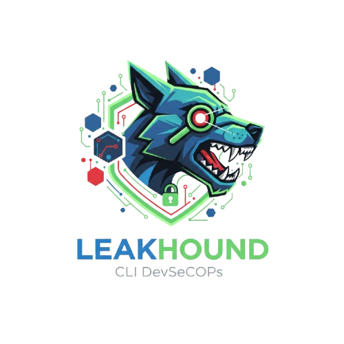

<p align="center">
  
</p>

<h1 align="center">Leakhound</h1>

<p align="center">
  Lightweight CLI tool for detecting leaked secrets in repositories
</p>


LeakHound is a lightweight DevSecOps CLI tool that scans repositories for leaked secrets and fails CI when findings are detected.

It masks sensitive values in output to prevent accidental re-exposure in logs.

It's designed to be fast, simple and easy to integrate into security pipelines

LeakHound never prints full secret values.

## Features

- Scan single file or directories (recursive)
- File and line number reporting
- Multiple secret detectors (AWS, JWT, Private Keys)
- Detector-specific masking strategies
- Regex based secret detection
- Safe output (prevents secret reexposure)
- Ignoring common folders like .git, node_modules, vendor
- Skips common binary file types
- Simple CLI usage
- Minimal dependencies
- Flexible CLI argument parsing

## Currently Supported Detectors

- AWS Access Key ID (AKIA....)
- JWT Keys
- Private Keys

## CI / GitHub Actions

Leakhound returns non zero exit code when findings are detected.
This makes it suitable as a CI gate to prevent secret leaks from being merged.

## Output Format

file_path:line_number [TYPE] MASKED_VALUE

## Example

.env:5 [AWS_ACCESS_KEY_ID] AKIA****\*\*\*\*****CDEF

tokens.txt:1 [JWT] eyJ******\*\*\*******c2P0

keys.pem:3 [PRIVATE_KEY] REDACTED

## Usage

Scan a file or directory:

Note: LeakHound accepts a single scan path. Additional positional arguments will result in an error.

```bash
go build -o leakhound .
./leakhound <path or file>

or

go run . <path or file>
```

Excluding

```bash
./leakhound . --exclude <path or file>

or

go run . <path or file> --exclude <path or file>
```

## Exit codes

0 No findings detected
1 Findings detected (CI should fail)
2 Usage / invalid arguments

## Install (Binary)

### Linux

Download the Linux binary from the GitHub Releases page, make it executable and run it from your terminal:

```bash
chmod +x leakhound-linux-amd64
./leakhound-linux-amd64
```

### macOs

Download the macOS binary from the GitHub Releases page, make it executable and run it:

```bash
chmod +x leakhound-darwin-amd64
./leakhound-darwin-amd64
```

### Windows

Download the Windows executable (.exe) from the GitHub Releases page and run it from PowerShell or Command Prompt:

```bash
leakhound-windows-amd64.exe
```

## Version Information

LeakHound provides build metadata for easier debugging and traceability.

Run:

```bash
leakhound --version
```

### Example Output

LeakHound v0.1.0

Commit : <git-commit-hash>
Platform : <os-arch>
Build date : <build-date>

## Help Output

LeakHound provides a clear CLI help output for easier usage.

Run:

```bash
leakhound --help
```

### Example output:

LeakHound - DevSecOps Secret Scanner

Usage:
leakhound <path> [options]

Options:
--exclude Exclude files or directories from scanning (repeatable)
--version Show version and build information
--help Show this help message

## Build from source

Build a local binary with embedded version metadata:

```bash
./scripts/build.sh
```

```md
You can override the version: `VERSION=v0.1.1 ./scripts/build.sh`
```
